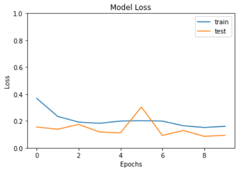
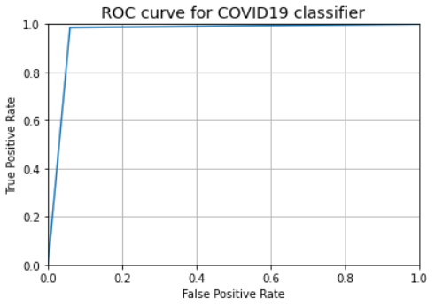

# PneumoniaTypeClassifier
DL classifiers for classifying various types of pneumonia(including COVID-19 induced pneumonia) from unsegmented chest x-ray scans (acquired from the <a href = "https://github.com/ieee8023/covid-chestxray-dataset">Cohen repo</a>.)

## Details
This project has two classifier models to classify viral and bacterial pneumonia. Separate classifiers were made after taking into account the sizes of both groups' datasets and their quality. Eg. the bacterial dataset has a significantly higher number of x-rays than the viral dataset and includes more diversity in origin as shown below.

Taking this into account, it was decided that even a high degree of augmentation on the viral dataset would not solve the problem of bias towards the bacterial group in a single classifier.

## Viral Classifier
Taking into account constraints on the dataset size and it's overall simplicity, a sequential model of stacked Conv2D, Dense, Dropout and MaxPooling were used to form the network.

Inputs were resized to 224 x 224 pixels (in accordance to ImageNet), and augmented with random flips, rotatations, zooms and shears. The network is trained for 10 epochs with a batch size of 10. Train and test sets are split 80:20 keeping in mind the Pareto principle.

Training Accuracy

Training Loss

ROC Curve

Grad CAM output

